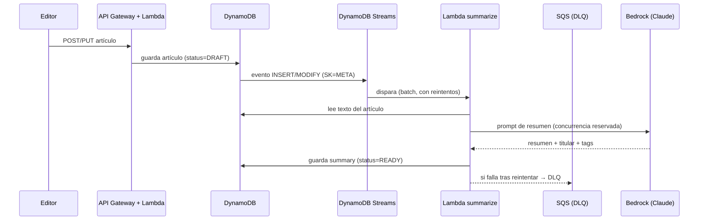
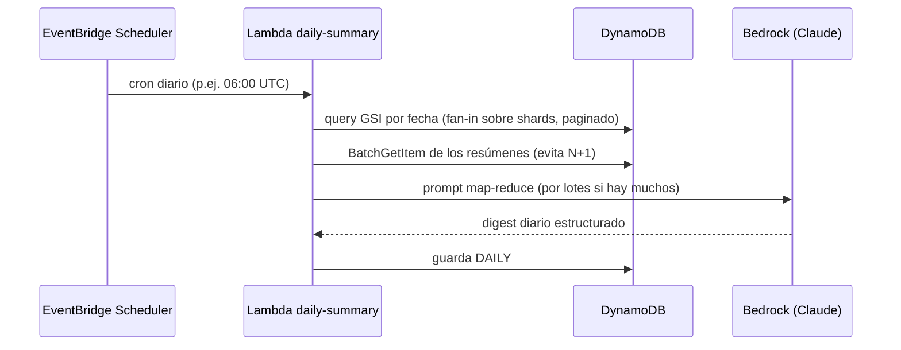

# Diagrama de arquitectura — Asistente de IA

> Detalle del subsistema de IA (resumen individual + resumen diario).
>
> Versión **draw.io** en [`newsnow-arquitectura.drawio`](newsnow-arquitectura.drawio) →
> página *Flujo de IA*.

## 1. Resumen de un artículo individual (event-driven)

**Por qué event-driven y no síncrono:** el editor no espera al LLM. El resumen se
genera en segundo plano y el artículo pasa de `DRAFT` a `READY` cuando está listo.
**DynamoDB Streams dispara la Lambda directamente** (con *batching* y reintentos, que
ya amortiguan las ráfagas de carga masiva); una cola **SQS** hace de *dead letter
queue* para los eventos que fallan tras reintentar. Una **concurrencia reservada**
limita las llamadas simultáneas a Bedrock para no provocar *throttling* en un pico.

## 2. Resumen diario (batch programado)

**Estrategia map-reduce jerárquica:** en lugar de mandar todos los artículos completos
(que excederían la ventana de contexto y serían caros), se usan los **resúmenes ya
generados** de cada artículo (paso 1) y se pide a Bedrock un *resumen de resúmenes*. Si
un día trae muchos, se reduce **por lotes** y los digests parciales se combinan en una
ronda posterior, de modo que **ninguna llamada desborda el contexto**. Los resúmenes se
leen con **BatchGetItem** (no un `GetItem` por artículo) para no agotar el tiempo de la
Lambda a gran volumen.

## 3. Modelo de datos en DynamoDB (single-table)

| PK | SK | Atributos |
|---|---|---|
| `ARTICLE#<id>` | `META` | title, body, author, category, status, created_at |
| `ARTICLE#<id>` | `SUMMARY` | summary, headline, tags, model, tokens |
| `DAILY#<date>` | `SUMMARY` | digest, article_ids, created_at |

- **GSI1** (`GSI1PK = DATE#<yyyy-mm-dd>#<shard>`, `GSI1SK = created_at`) para consultar
  los artículos publicados en un día → alimenta el resumen diario y la portada. La
  clave incluye un **shard** (0–9) para repartir la escritura y evitar una *hot
  partition* bajo picos; las lecturas hacen *fan-in* sobre todos los shards.
