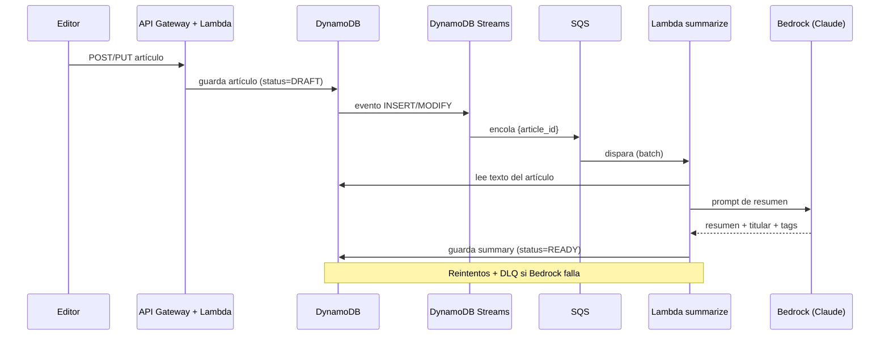
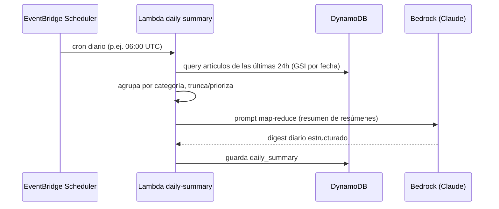

# Diagrama de arquitectura — Asistente de IA

> Detalle del subsistema de IA (resumen individual + resumen diario).
>
> Versión **draw.io** en [`newsnow-arquitectura.drawio`](newsnow-arquitectura.drawio) →
> página *Flujo de IA*.

## 1. Resumen de un artículo individual (event-driven)

**Por qué event-driven y no síncrono:** el editor no espera al LLM. El resumen se
genera en segundo plano y el artículo pasa de `DRAFT` a `READY` cuando está listo.
SQS amortigua ráfagas (p. ej. carga masiva de artículos) y da reintentos + *dead
letter queue* gratis.

## 2. Resumen diario (batch programado)

**Estrategia map-reduce:** en lugar de mandar todos los artículos completos (que
excederían la ventana de contexto y serían caros), se usan los **resúmenes ya
generados** de cada artículo (paso 1) y se pide a Bedrock un *resumen de resúmenes*.
Es más barato, rápido y escalable.

## 3. Modelo de datos en DynamoDB (single-table)

| PK | SK | Atributos |
|---|---|---|
| `ARTICLE#<id>` | `META` | title, body, author, category, status, created_at |
| `ARTICLE#<id>` | `SUMMARY` | summary, headline, tags, model, tokens |
| `DAILY#<date>` | `SUMMARY` | digest, article_ids, created_at |

- **GSI1** (`GSI1PK = DATE#<yyyy-mm-dd>`, `GSI1SK = created_at`) para consultar los
  artículos publicados en un día → alimenta el resumen diario y la portada.
