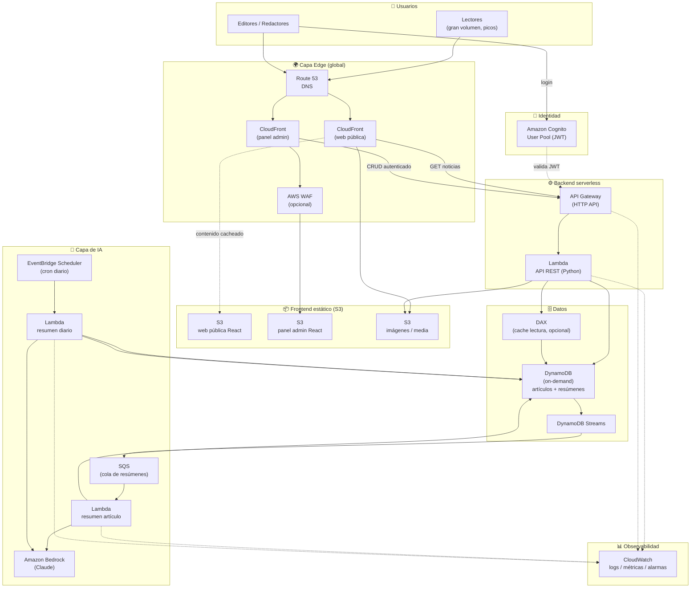

# Diagrama de arquitectura — Infraestructura

> Diagrama en **Mermaid** (se renderiza directamente en GitHub/GitLab/VS Code y es
> versionable en Git). En la entrega se incluye también export a imagen.
> Se puede reconstruir en [draw.io](https://draw.io) importando este mismo grafo.

## Flujo resumido

1. **Lectura pública (el 95 % del tráfico).** El lector llega vía Route 53 →
   CloudFront. La web React y las imágenes se sirven **desde la caché del CDN**,
   sin tocar el origen. Las llamadas a la API para leer noticias también se cachean
   en CloudFront/API Gateway. Esto es lo que absorbe los picos de influencers.

2. **Escritura (panel admin).** El editor se autentica en **Cognito**, que emite un
   JWT. El panel React llama al **API Gateway**, que valida el token y ejecuta la
   **Lambda** del backend (CRUD sobre **DynamoDB** e imágenes en **S3**).

3. **IA: resumen individual.** Al crear/editar un artículo, **DynamoDB Streams**
   emite un evento → **SQS** (buffer que amortigua los picos) → **Lambda** que llama
   a **Bedrock** y guarda el resumen en DynamoDB.

4. **IA: resumen diario.** **EventBridge Scheduler** dispara una Lambda cada día que
   recopila los artículos de la jornada, pide a **Bedrock** un digest y lo persiste.
