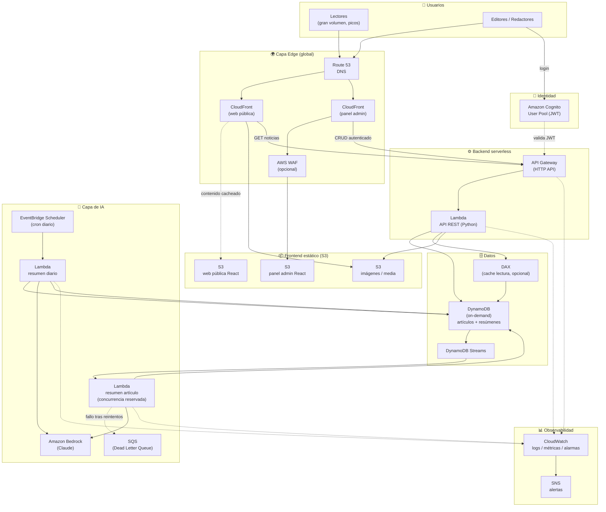

# Diagrama de arquitectura — Infraestructura

> Diagrama en **Mermaid** (se renderiza directamente en GitHub/GitLab/VS Code y es
> versionable en Git). La versión **draw.io** que sugiere el enunciado está en
> [`newsnow-arquitectura.drawio`](newsnow-arquitectura.drawio) → página *Infraestructura*
> (ábrela en [draw.io](https://draw.io) / diagrams.net).

## Flujo resumido

1. **Lectura pública (el 95 % del tráfico).** El lector llega vía Route 53 →
   CloudFront. La web React se sirve **desde la caché del CDN**, sin tocar el origen. Y
   las lecturas de la API (`/articles`, `/daily-summary`) van por un **segundo origen
   de CloudFront con TTL corto**, así que también se responden desde el edge. Esto es lo
   que absorbe los picos de influencers.

2. **Escritura (panel admin).** El editor se autentica en **Cognito**, que emite un
   JWT. El panel React llama al **API Gateway**, que valida el token y ejecuta la
   **Lambda** del backend (CRUD sobre **DynamoDB** e imágenes en **S3**).

3. **IA: resumen individual.** Al crear/editar un artículo, **DynamoDB Streams**
   dispara directamente la **Lambda** (con *batching* y reintentos, que amortiguan los
   picos), que llama a **Bedrock** y guarda el resumen en DynamoDB. Una cola **SQS** hace
   de **DLQ** para los eventos que fallan tras reintentar.

4. **IA: resumen diario.** **EventBridge Scheduler** dispara una Lambda cada madrugada
   que recopila los artículos de la **jornada anterior** (ya completa), pide a
   **Bedrock** un digest y lo persiste.

> **Nota de alcance:** **Route 53**, **WAF** y **DAX** aparecen como *estado objetivo* de
> una arquitectura completa. El Terraform del MVP usa los **dominios por defecto de
> CloudFront** (sin Route 53), **sin WAF** y **sin DAX** (se activan cuando el tráfico o
> la seguridad lo justifiquen — ver la hoja de ruta en `01-infraestructura.md`). El resto
> de nodos del diagrama **sí** están implementados en [`../../terraform/`](../../terraform/).
